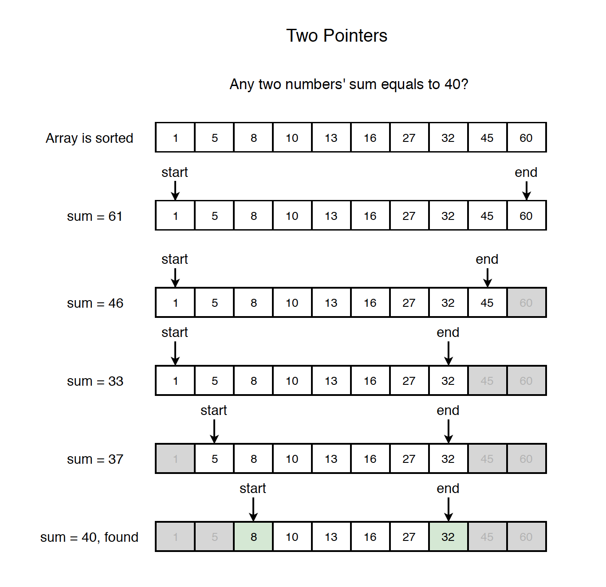

# Two Pointer Algorithm
The two-pointer algorithm is a technique used to solve problems involving arrays or lists. It involves using two pointers to iterate through the array, often from opposite ends, to find a solution that meets certain criteria. This technique is particularly useful for problems involving pairs of elements, such as finding two numbers that add up to a specific target.

*Time Complexity of Two Pointer Algorithm is `O(n)`.*

